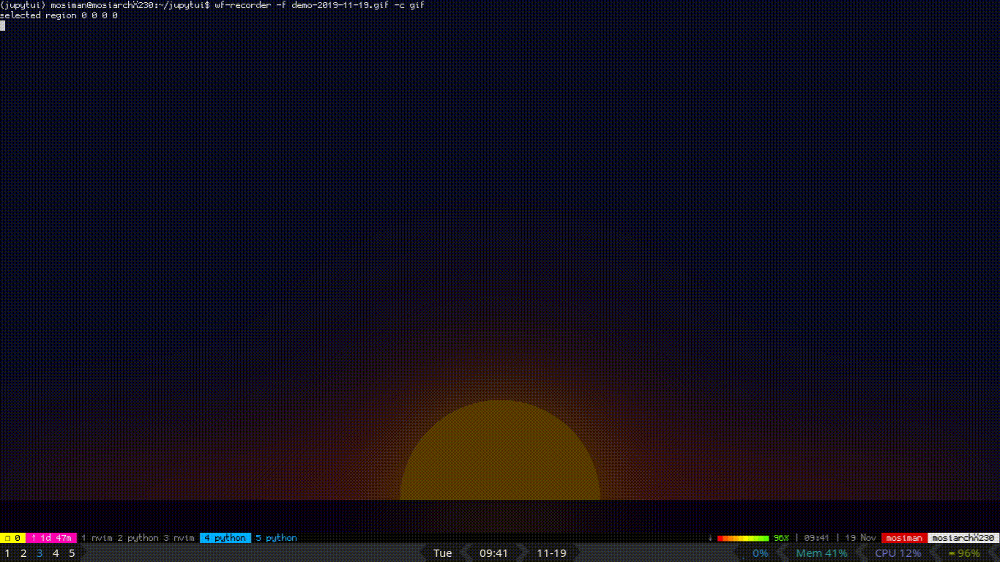

## branch: 'rework'

The project is getting messy, there are too many parts and I'm getting confused. A lot of it is because I didn't know about some previously implemented functionality, etc. Need to try to rework this so that it's 'scalable' in terms of being able to work on it in the future. 

I should make better use of signals, and try to compartmentalize functionality. 

# Jupytui

A terminal client for Jupyter notebooks. 

The goal is to eventually be able to have a terminal client that modifies notebooks and connects to the kernel. Images and other graphics are possibly feasible using Kitty's [terminal graphics protocol](https://sw.kovidgoyal.net/kitty/graphics-protocol.html). 

## Stack

- urwid 
- python 3.7+
- Maybe Kitty

## Demo 

A most recent demo, reading the [census notebook](https://anaconda.org/jbednar/census/notebook)

So far, it's reading and navigating the JSON only. Not connected to any kernel. 

